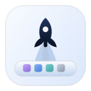

# Docking

<p align="center">
  
</p>

Docking is a native macOS overlay dock built with SwiftUI and a small AppKit
windowing layer.

It provides a configurable dock panel, app and folder items, calendar/weather
widgets, and a Control Center for settings.

Docking was built for desktops where the menu bar is already crowded: frequently
used actions and glanceable information can live in the dock instead. It also
supports Liquid Glass appearance presets.

## Requirements

- macOS 26 or later.

## Install

Install with Homebrew:

```bash
brew tap sk-226/docking https://github.com/sk-226/docking
brew trust --cask sk-226/docking/docking
brew install --cask sk-226/docking/docking
```

`brew trust --cask` is required because this repository is used directly as the
cask tap. Prefer trusting only this cask instead of disabling Homebrew tap trust
checks globally.

If Homebrew reports `Tap sk-226/docking remote mismatch`, remove the old tap and
tap the GitHub repository again:

```bash
brew untap sk-226/docking
brew tap sk-226/docking https://github.com/sk-226/docking
```

A standalone build is available from the
[v0.0.4 release](https://github.com/sk-226/docking/releases/tag/v0.0.4) as a
DMG. This 0.0.4 build is not Developer ID notarized, so macOS may ask you to
confirm the app on first launch. If macOS blocks the first launch, approve
Docking in System Settings > Privacy & Security and launch it again.

Uninstall:

```bash
brew uninstall --cask sk-226/docking/docking
```

## Use and Restore

Installing Docking does not change Apple Dock settings. Docking starts as an
overlay dock.

To use Docking as the primary dock:

1. Launch Docking.
2. Open Control Center > Restore.
3. Click Use Docking as Primary Dock and confirm.
4. Click Reload Apple Dock to Apply if needed.

To return to the Apple Dock:

1. Open Control Center > Restore.
2. Click Disable Docking replacement mode, or Restore Original macOS Dock
   Settings, and confirm.
3. Click Reload Apple Dock to Apply if needed.

If you enabled Primary Dock mode, restore the Apple Dock before uninstalling.
Uninstalling Docking removes the app, but it does not restore Apple Dock
preferences.

## Build

```bash
swift build --product Docking
```

Run the app from a staged macOS app bundle:

```bash
./script/build_and_run.sh
```

## Validate

Run the framework-free validation executable:

```bash
swift run DockingValidation
```

Before sharing a local build, run:

```bash
./script/release_check.sh
```

Manual checks that cannot be covered by SwiftPM are tracked in [QA.md](QA.md).
Performance checks are tracked in [PERFORMANCE.md](PERFORMANCE.md).
Maintainer notes are in [DEVELOPMENT.md](DEVELOPMENT.md).

## Permissions and Privacy

- Calendar events are read locally through EventKit.
- Location is requested only when current-location weather is enabled.
- Weather can use Open-Meteo for manual-city or fallback weather data.
- App usage is not uploaded.
- There is no analytics code.
